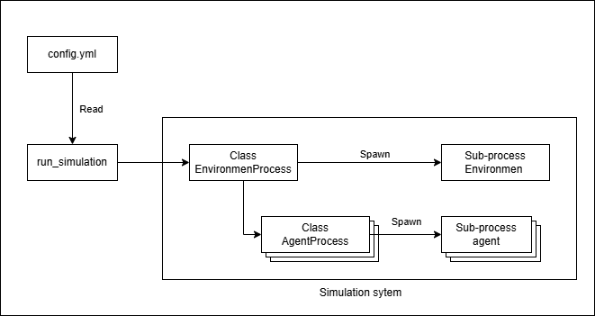
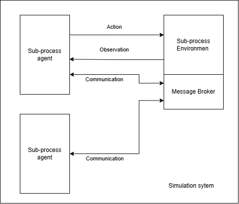

# Architecture Documentation

This document provides a detailed overview of the architecture for the Multi-Agent Sweeping Simulator. It outlines the main components, their interactions, and the modular design principles that enable easy extensibility for various research and development purposes.

---

## 1. Overview

The Multi-Agent Sweeping Simulator is a modular and decentralized multi-agent system where agents operate within a shared environment. The system enables indirect communication between agents via a centralized environment broker (SimEnvironment), offering the following features:
- Visualization of the simulation.
- Configuration-driven initialization.
- A mailbox system for asynchronous message handling.

---

## 2. Simulation Setup and Subprocess Management

The simulation operates by spawning multiple subprocesses to handle the environment and agents. The architecture ensures that:
- The `EnvironmentProcess` spawns its own subprocess to manage the environment.
- The `EnvironmentProcess` also creates and manages multiple `AgentProcess` instances.
- Each `AgentProcess` spawns a subprocess to handle the behavior of a single agent.

<p align="center">
  
</p>

---

## 3. Simulation Process

This section explains the three main stages of the simulation: initialization, simulation running, and termination.

### 3.1 Initialization
The initialization phase involves setting up the simulation environment and agents:
1. **Configuration Loading**:
   - The `run_simulation.py` script reads simulation parameters from the `config.yml` file.
   - The configuration specifies environment properties, agent IDs, and any additional parameters required for the simulation.
   
2. **Environment Initialization**:
   - The `EnvironmentProcess` is instantiated, and a subprocess (`run_environment.py`) is started to manage the simulation environment.

3. **Agent Initialization**:
   - The `EnvironmentProcess` spawns `AgentProcess` instances for each agent defined in the configuration.
   - Each `AgentProcess` starts its own subprocess (`run_agent.py`) to handle the agent's behavior.

### 3.2 Simulation Running
<p align="center">
  
</p>

During this phase, the environment and agents operate concurrently:
1. **Environment Process**:
   - The `EnvironmentProcess` manages the global state and oversees the interactions between agents.
   - Periodic updates may occur, such as changes in the environment or updates to the simulation state.

2. **Agent Processes**:
   - Each agent runs independently within its subprocess, performing actions such as:
     - Observing the environment.
     - Making decisions based on its behavior model.
     - Communicating indirectly via the environment.

3. **Monitoring**:
   - The system continuously monitors all subprocesses (environment and agents) to ensure they are running as expected.
   - If any subprocess stops unexpectedly, the system logs warnings or attempts to recover.

### 3.3 Simulation Termination
The termination phase ensures a clean shutdown of all processes:
1. **User Interrupt**:
   - The simulation can be terminated by the user (e.g., pressing `Ctrl+C`), triggering a `KeyboardInterrupt`.

2. **Agent Process Termination**:
   - The `EnvironmentProcess` sends termination signals to all running `AgentProcess` instances.
   - Each `AgentProcess` stops its subprocess (`run_agent.py`) gracefully.

3. **Environment Process Termination**:
   - The `EnvironmentProcess` terminates its subprocess (`run_environment.py`).
   - Logs confirm that all processes have been terminated.

4. **Cleanup**:
   - Resources, such as file handles or memory, are released.
   - Final logs are written to ensure traceability.

---

## 4. Components

### 4.1 `EnvironmentProcess`
The `EnvironmentProcess`:
- Manages the global simulation state.
- Spawns and monitors the environment subprocess.
- Initializes and coordinates `AgentProcess` instances.

**Key Methods:**
- `start()`: Starts the environment subprocess.
- `start_agents()`: Spawns and starts agent subprocesses.
- `monitor()`: Monitors the environment subprocess and handles interruptions.
- `terminate_all()`: Terminates all active subprocesses gracefully.

### 4.2 `AgentProcess`
The `AgentProcess`:
- Represents a single agent in the simulation.
- Spawns a subprocess to execute the agent's behavior defined in `run_agent.py`.

**Key Methods:**
- `start()`: Starts the agent subprocess.
- `terminate()`: Stops the agent subprocess if running.

---

## 5. Design Principles

### 5.1 Modularity
Each component (environment, agent) is encapsulated in a class, ensuring separation of concerns and facilitating independent development or debugging.

### 5.2 Extensibility
- The architecture supports easy integration of new agent behaviors or environment configurations by modifying the configuration file (`config.yml`) and extending base classes.

### 5.3 Decentralization
Agents operate independently, interacting only via the shared environment, which acts as a broker for indirect communication.

---

## 6. Configuration

The system uses a YAML file (`config.yml`) for configuration, allowing users to specify:
- Environment settings.
- Agent properties, such as IDs and initial states.
- Simulation parameters (e.g., number of agents, environment size).

---

## 7. How to Run

1. Prepare the `config.yml` file with the desired simulation parameters.
2. Run the simulation:
   ```bash
   python run_simulation.py
